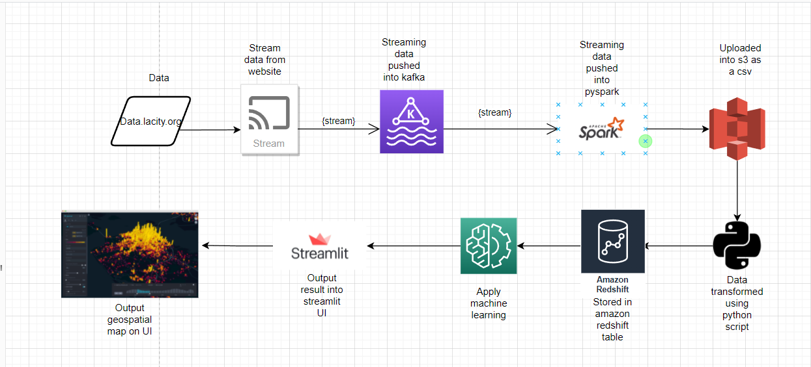

# **Understanding Geospatial Patterns in Los Angeles Traffic Collisions**

### **A Brief Introduction...**
According to the [2021 Urban Mobility Report by the Texas A&M Transportation Institute](https://static.tti.tamu.edu/tti.tamu.edu/documents/mobility-report-2021.pdf), the average Los Angeles commuter wasted 46 hours sitting in traffic in 2020. This project collects publicly available collision data via a simulated, real-time stream (Kafka) and analyzes traffic collision patterns in Los Angeles using parallel processing and cloud-based computing/storage (Spark, AWS). Users will be able to upload collision data sets, obtain a geospatial map of high-risk areas, explore the data, and predict future high-risk areas.

### **The Data**
Data is provided by the Los Angeles Police Department and is updated on a weekly basis. Each observation of data represents a traffic collision with features related to time, location, and victim attributes. The data is accessed via a web API provided by the city. For additional metadata information, please refer to the dataset [**here**](https://data.lacity.org/Public-Safety/Traffic-Collision-Data-from-2010-to-Present/d5tf-ez2w).

### **Architecture & Design**
The application combines the use of AWS EC2, AWS S3, AWS Redshift, Apache Spark, and Apache Kafka to provide real-time analysis of data using parallel processing and cloud-based computing/storage.

Using an EC2 instance, an Apache Kafka stream is run which accesses the source data web API and extracts data on a daily basis. The data is then transformed into a Spark Dataframe and written as a CSV file on an S3 cluster. Using Python, the data is grabbed from the S3 cluster, transformed, and appended onto a production Redshift database. For modeling, the data is queried as a Spark Dataframe, feature engineered and then trained in parallel using the MLlib library. Finally, the data, model output, and data transformations are visualized through the Streamlit UI package, which is a Python-based front-end web framework.

### **Functions & Components**
The following functions/components are available in the application:
- Users can upload and view their own traffic collision data as a CSV file and attain monthly predictions for collision risk.
- Automatic cleaning, transforming, feature engineering, and uploading of data onto production cloud databases.
- Intuitive data exploration interface for exploring raw data, transformed features, geospatial mappings, and model results.
- Utilizing Pyspark for data streaming, feature extraction, and training ML models in parallel.
- Attain predicted risk ratings for Los Angeles City collision levels using Machine Learning models.
- Live data streaming and extraction using Apache Kafka.
- Projection and visualization of traffic collision data using geographical coordinates onto interactive geospatial maps.

### **Software & Tools**
The following software and tools were used to create this application:

**Databases & Storage**
- AWS Redshift: Cloud Relational Database
- AWS S3: Cloud Data Storage
- AWS EC2: Cloud Computing
- Apache Kafka: Data Streaming & Processing

**Software and Libraries**
- Python
    - Pandas
    - Numpy
    - Matplotlib
    - Seaborn
    - Requests
    - GeoPandas
    - Redshift_connector
    - JSON
    - SQL
    - PySpark
    - Spark Streaming
    - Spark MLlib
    - Streamlit
    - Kepler.gl

- Tools
    - Github
    - Git
    - Jupyter Notebook

## ***To view a demo of the application, click [here](https://drive.google.com/file/d/1Hxmvfjux32PvoOncizb7WaVIYw__12Nf/view?usp=sharing).***